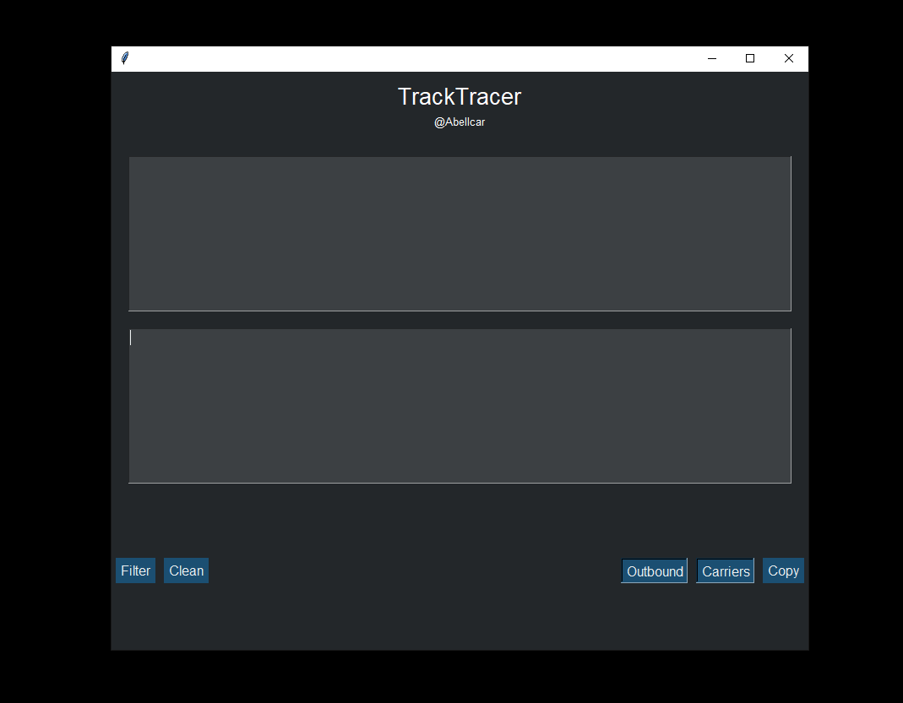
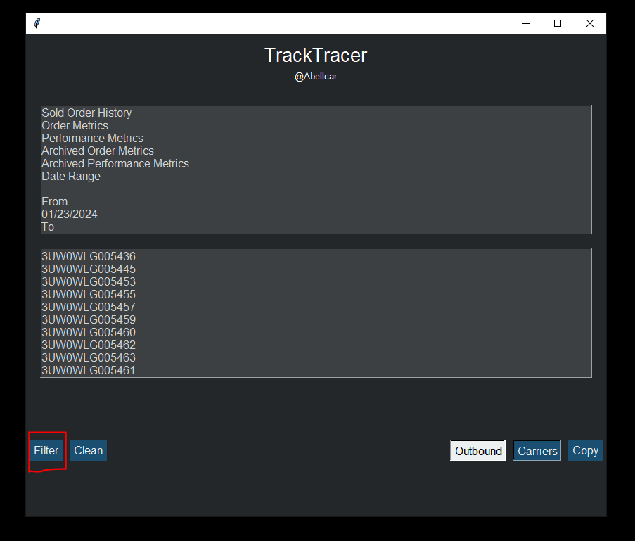
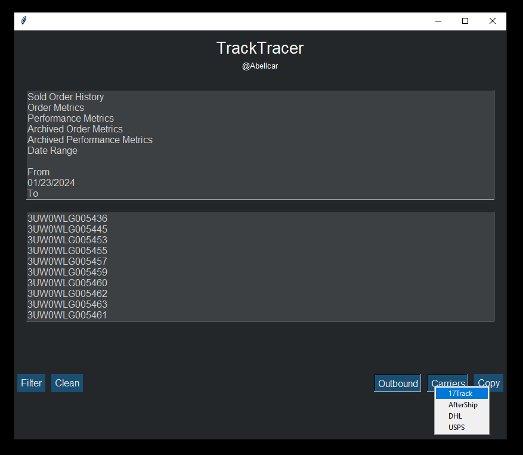
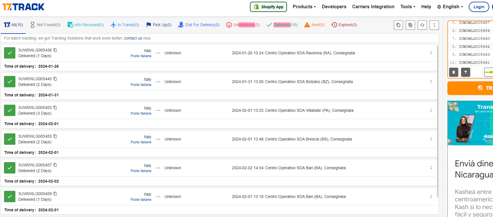
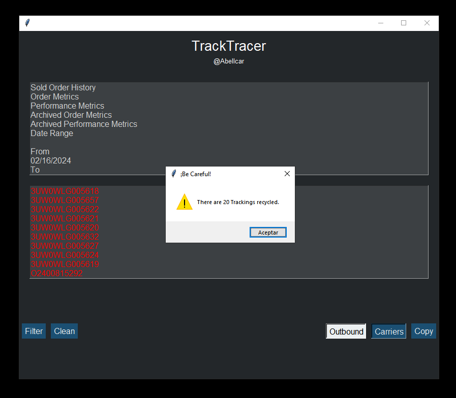

# TrackTracer

TrackTracer is a Python desktop tool designed to automate bulk tracking validation workflows.

It extracts tracking numbers from raw text, detects duplicates, and allows quick validation through carrier websites, reducing manual work and improving efficiency.

---

## Screenshots

### Main interface


### Filtered tracking results


### Carrier selection


### Public validation example in 17TRACK


### Duplicate tracking detection


---

## Features

- Extract tracking numbers from unstructured text
- Clean and format results automatically
- Detect and highlight duplicate tracking numbers
- Open multiple tracking IDs in public carrier websites
- Simple desktop interface built with Tkinter

---

## How It Works

1. Paste raw text containing tracking information into the input box
2. Click **Filter** to extract tracking numbers
3. Review the results in the output box
4. Use **Carriers** to validate the extracted tracking numbers in external platforms
5. Detect duplicated tracking entries automatically

---

## Supported Carriers

- 17Track
- AfterShip
- DHL
- USPS

---

## Tech Stack

- Python
- Tkinter
- Regular Expressions
- Webbrowser module

---

## Impact

- Reduced manual tracking validation time
- Improved operational efficiency by ~25%
- Enabled bulk processing of tracking data
- Simplified repetitive review tasks in high-volume workflows

---

## Run Locally

Make sure Python is installed, then run:

```bash
python TrackTracer.py
```

---

## Notes

This is a generalized and sanitized version of a tool originally developed to optimize workflows in high-volume environments.

---

## Author

Carlos Esteban Bello Salinas
